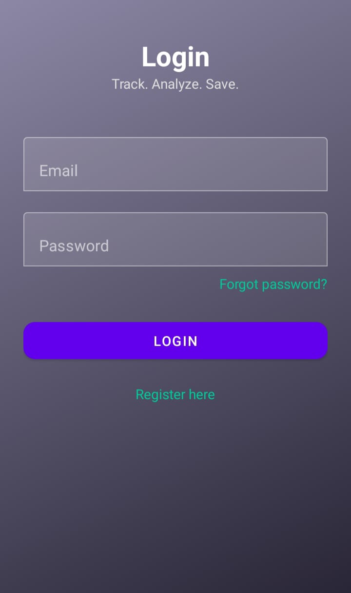
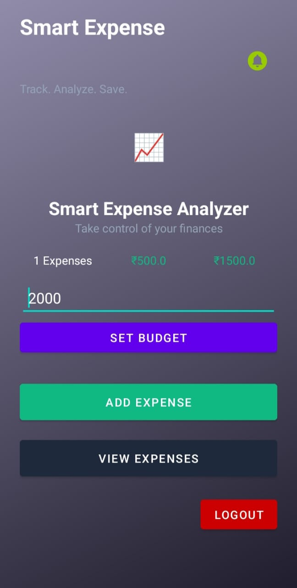
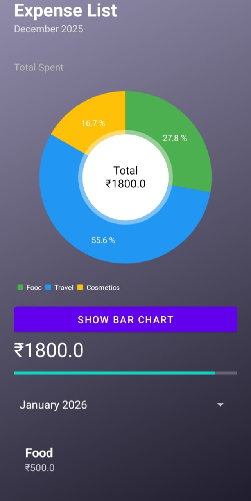
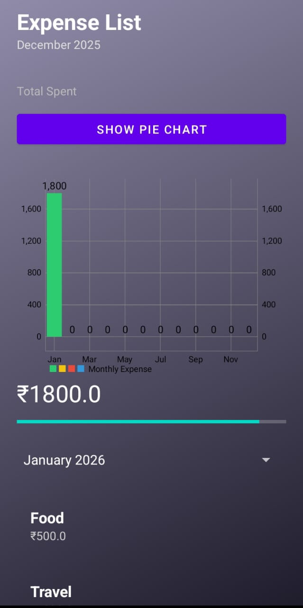

# 📱 Smart Expense Analyzer

Smart Expense Analyzer is an Android application designed to help users track daily expenses, manage monthly budgets, and visualize spending patterns using interactive charts.

---

## ✨ Features

- 🔐 Firebase Authentication (Login / Register / Forgot Password)
- 💰 Add, edit, and delete expenses
- 📊 Category-wise expense visualization using **Pie Chart**
- 📈 Monthly expense overview using **Bar Chart**
- 📅 Filter expenses by month
- 🚨 Budget warning alerts (Safe / Near Limit / Exceeded)
- ☁️ Firebase Firestore for cloud data storage
- 🎨 Modern Material UI design

---

## 🛠️ Tech Stack

- **Language:** Java  
- **IDE:** Android Studio  
- **UI:** Material Components  
- **Database:** Firebase Firestore  
- **Authentication:** Firebase Auth  
- **Charts:** MPAndroidChart  
- **Build Tool:** Gradle  

---
## 📸 Screenshots

### 🔐 Login Screen


### 🏠 Dashboard


### 🥧 Expense Pie Chart


### 📊 Monthly Bar Chart


### 📋 Adding Expenses


---

## 🚀 How to Run the Project

1. Clone the repository:
   ```bash
   git clone https://github.com/Nosiyadevi/SmartExpenseAnalyzer.git
